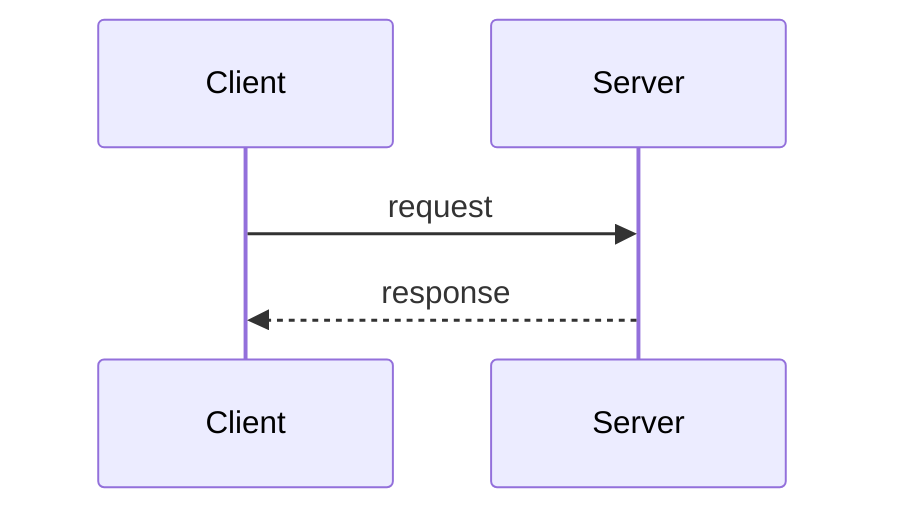

# E2.S5 — pr-summarizer port with sequence diagrams

> **Superseded note:** The Mermaid sequence-diagram capability described in this story was later removed from `pr-summarizer`. GitHub does not render Mermaid in PR comments and Bitbucket does not render it at all, so the feature added cost and prompt complexity without proportional value. The summarizer now emits summary, PR type, effort, and the walkthrough table only. This story is retained as the as-built record of the original Epic 2 implementation.

## Summary

Implement `ai_pr_review/agents/summarizer.py` — the typed orchestration wrapper around the
`pr-summarizer` LLM agent. This module assembles the summarizer context (file manifest, commit log,
diff), invokes the LLM, parses/validates the output into a typed `SummarizerOutput` dataclass, and
optionally extends the prompt to request a Mermaid sequence-diagram section. The Mermaid block, when
generated, is validated syntactically before being emitted; invalid Mermaid is silently dropped
rather than surfaced to the PR description.

The LLM prompt file `prompts/pr-summarizer.md` is unchanged. When diagrams are enabled, a small
addendum is appended to the system prompt requesting one sequence diagram focused on the most
significant control-flow change in the diff.

## PRD Reference

2.FR-5 — resolves #100

## Acceptance Criteria

- [x] AC1: `SummarizerOutput` is a frozen dataclass with `summary_md: str`, `pr_type: str`,
  `effort: int`, `walkthrough: list[WalkthroughRow]`, and `sequence_diagram: str | None`.
- [x] AC2: `WalkthroughRow` is a frozen dataclass with `file: str`, `change: Literal["Added",
  "Modified", "Deleted", "Renamed"]`, `summary: str`.
- [x] AC3: `parse_summarizer_output(raw: str, include_diagram: bool) -> SummarizerOutput` parses the
  raw LLM response. Headings `## Summary`, `## Walkthrough`, and (when `include_diagram`)
  `## Sequence Diagrams` are the anchors. Malformed Mermaid is dropped (set to None) with a warning
  to stderr.
- [x] AC4: `is_valid_mermaid(block: str) -> bool` accepts Mermaid `sequenceDiagram` blocks and rejects
  obviously malformed input: missing `sequenceDiagram` header, unbalanced arrows, or empty body.
  Non-destructive — does not require a full parser.
- [x] AC5: `build_summarizer_system_prompt(base_path: Path, include_diagram: bool) -> str` reads the
  base prompt and, when `include_diagram=True`, appends a short Mermaid-request addendum (inlined in
  the module, not read from disk).
- [x] AC6: `build_summarizer_user_message(manifest: str, commit_log: str, diff_text: str) -> str`
  returns a structured message with clear section headers: `## Manifest`, `## Commit log`, `## Diff`.
- [x] AC7: Effort parsing: integer in `[1, 5]`. If the LLM emits something outside that range,
  default to 3 and log a warning.
- [x] AC8: PR type is normalized to lowercase; must be one of `feature`, `bugfix`, `refactor`,
  `docs`, `config`, `test`, `mixed`. Unknown values default to `mixed`.
- [x] AC9: `mypy --strict` and `ruff check` clean on all new code.
- [x] AC10: Unit tests cover happy-path parsing, missing-section fallback, malformed Mermaid drop,
  out-of-range effort, unknown PR type, and diagram-enabled vs disabled prompt building.

## Tasks/Subtasks

- [x] T1: Create `ai_pr_review/agents/summarizer.py`
  - [x] T1.1: Define `WalkthroughRow` and `SummarizerOutput` frozen dataclasses
  - [x] T1.2: Implement `build_summarizer_system_prompt`
  - [x] T1.3: Implement `build_summarizer_user_message`
  - [x] T1.4: Implement `is_valid_mermaid`
  - [x] T1.5: Implement `parse_summarizer_output`

- [x] T2: Write tests in `tests/python/agents/test_summarizer.py`
  - [x] T2.1: Parse happy-path output (summary + walkthrough + no diagram)
  - [x] T2.2: Parse output with valid Mermaid sequence diagram
  - [x] T2.3: Drop malformed Mermaid (missing `sequenceDiagram` header)
  - [x] T2.4: Fallback when `## Summary` heading is missing
  - [x] T2.5: Fallback when `## Walkthrough` heading is missing (empty list)
  - [x] T2.6: Effort clamped to [1,5]; default 3 on parse failure
  - [x] T2.7: Unknown PR type → `mixed`
  - [x] T2.8: `build_summarizer_system_prompt` appends addendum only when `include_diagram=True`
  - [x] T2.9: `build_summarizer_user_message` formats all three sections

- [x] T3: Run full test suite + mypy + ruff; confirm clean

## Dev Notes

### Context from issue #100

Sequence diagrams were removed in v0.3.2 (#99) because GitHub does not render Mermaid in PR
*comments* (only in `.md` files and PR *description bodies*), and Bitbucket doesn't render Mermaid at
all. This story reintroduces diagram generation with three safeguards:

1. **Opt-in**: a boolean flag controls whether the addendum is appended to the prompt.
2. **Validated**: `is_valid_mermaid` rejects obviously broken blocks before emitting.
3. **Target-aware**: the VCS posting layer (Epic 2 S9–S11) decides whether to emit the diagram into
   the PR description body or drop it.

### Mermaid sequence-diagram shape

Expected shape for the LLM to emit:

````markdown
## Sequence Diagrams


````

### Validation rules for `is_valid_mermaid`

- Body must start with `sequenceDiagram` (after leading whitespace/newlines stripped)
- Body must contain at least one arrow (`->>`, `-->>`, `->`, `-->`) — otherwise the diagram is empty
- Body must not contain unclosed code fences (no bare ` ``` ` inside)

This is a syntactic smoke check, not a full Mermaid parser. Real rendering validation happens
client-side in GitHub.

### Previous learnings from E2.S1–S4

- `from __future__ import annotations`
- Frozen dataclasses; stdlib only
- `re.compile()` at module level
- Tests: `pytest`, no async needed
- `mypy --strict` with `from collections.abc import Mapping` (not `typing.Mapping`)

## File List

- `ai_pr_review/agents/summarizer.py` (new)
- `tests/python/agents/test_summarizer.py` (new)
- `memory-bank/bmad/stories/2-5-summarizer.md` (this file)

## Change Log

- 2026-05-12: Created E2.S5 story — pr-summarizer port with sequence diagrams.
